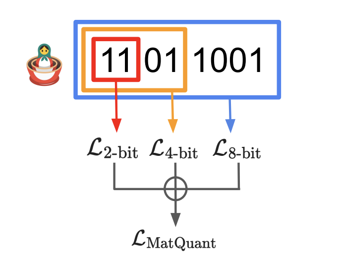

# Matryoshka Quantization with OmniQunat (Unoffical)

Matryoshka Quantization is an innovative quantization technique for Large Language Models (LLMs) that provides multiple bit precisions in a single model. This project is an implementation of Matryoshka Quantization based on OmniQuant.



## Key Features

- **Matryoshka Structure**: Provides different precision levels (8-bit, 4-bit, 2-bit) in a single model
- **OmniQuant Optimization**: Minimizes accuracy loss during quantization
- **Current Support**: Currently only supports OPT models (support for LLaMA, Llama-2, Falcon, Mixtral is planned)
- **Group Quantization**: Supports group-wise quantization for efficient memory usage

## Installation

Install using Docker:

```bash
# Build Docker image
docker build -t matquant .

# Run Docker container
./run_matquant_docker.sh
```

## Usage

### Running Quantization

Example of converting OPT-125M model with Matryoshka Quantization:

```bash
./run_opt125m_matquant.sh
```

Or use the command directly:

```bash
python main_matquant.py \
  --model facebook/opt-125m \
  --abits 16 \
  --group_size 128 \
  --bit_list 8 4 2 \
  --lambda_r 0 1.0 0 \
  --let \
  --lwc \
  --mode quant \
  --epochs 1 \
  --nsamples 128 \
  --batch_size 4 \
  --output_dir ./matquant_output/opt-125m-matquant
```

### Evaluating Quantized Models

```bash
./run_opt125m_matquant_eval.sh
```

## Related Projects
[SmoothQuant: Accurate and Efficient Post-Training Quantization for Large Language Models](https://github.com/mit-han-lab/smoothquant)

[AWQ: Activation-aware Weight Quantization for LLM Compression and Acceleration](https://github.com/mit-han-lab/llm-awq)

[GPTQ: Accurate Post-training Compression for Generative Pretrained Transformers](https://github.com/IST-DASLab/gptq)

[RPTQ: Reorder-Based Post-Training Quantization for Large Language Models](https://github.com/hahnyuan/RPTQ4LLM)

[OmniQuant: Omnidirectionally Calibrated Quantization for Large Language Models](https://github.com/OpenGVLab/OmniQuant)

[MLC LLM](https://github.com/mlc-ai/mlc-llm)

[AutoGPTQ](https://github.com/PanQiWei/AutoGPTQ)

